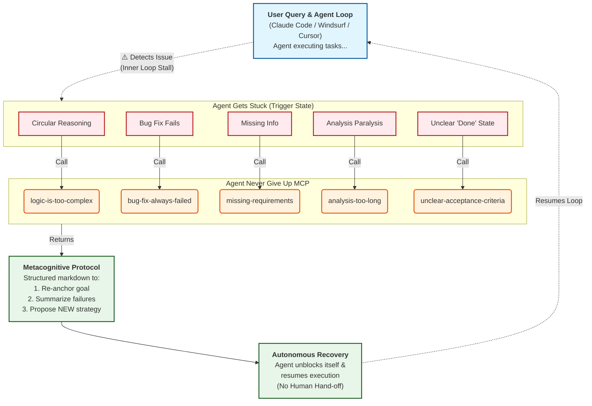

# Agent Never Give Up MCP

This is a MCP server that acts as a "escape guide" for AI coding agents. 

It provides structured thinking protocols to help agents unstuck themselves without human help.

The diagram below illustrates when an agent should call this server and what it receives in return:



## Features

- **Remote MCP server** at `/mcp` endpoint (Streamable HTTP specification compliant)
- **Two-tier scenario organization**:
  - **Core scenarios** (auto-registered as direct MCP tools):
    - `logic-is-too-complex` – for circular reasoning or over-complicated logic
    - `bug-fix-always-failed` – for repeated failed bug fix attempts
    - `missing-requirements` – for unclear or missing requirements
    - `lost-main-objective` – for when current actions feel disconnected from the original goal
    - `scope-creep-during-task` – for when changes expand beyond the original task scope
    - `long-goal-partially-done` – for multi-step tasks where remaining work is forgotten
    - `strategy-not-working` – for when the same approach fails repeatedly
  - **Extended scenarios** (discovered via `list_scenarios`, accessed via `get_prompt`):
    - `analysis-too-long` – for excessive analysis time
    - `unclear-acceptance-criteria` – for undefined acceptance criteria
    - `wrong-level-of-detail` – for working at wrong abstraction level
    - `constraints-cant-all-be-met` – for conflicting requirements or constraints
    - `blocked-by-environment-limits` – for environmental blockers vs logic problems
- **Discovery tools**:
  - `list_scenarios` – list all scenarios with their tier (core/extended)
  - `get_prompt` – access any scenario (core or extended)
- **Dual mode support**: Each tool supports `static` and `sampling` modes
- **Community-contributed prompts** via markdown files
- **Public and auth-less** (v0)
- **Cloudflare Workers deployment**

## Configuration

Since `agent-never-give-up` is a cloud-hosted MCP server, no local installation is required. Simply add the server configuration to your preferred AI tool.

### Install in Cursor

1. Open **Cursor Settings** > **MCP**.
2. Click **+ Add new global MCP server**.
3. Use the following configuration (or edit your `~/.cursor/mcp.json` file directly):

```json
{
  "mcpServers": {
    "agent-never-give-up": {
      "type": "http",
      "url": "https://agent-never-give-up-mcp.askman.dev/mcp",
      "note": "A 'Swiss Army knife' toolset to help agents recover from getting stuck"
    }
  }
}
```

### Install in Claude Desktop

To configure the server for Claude Desktop, edit the configuration file located at:

- **macOS:** `~/Library/Application Support/Claude/claude_desktop_config.json`
- **Windows:** `%APPDATA%\Claude\claude_desktop_config.json`

Add the following entry to the `mcpServers` object:

```json
{
  "mcpServers": {
    "agent-never-give-up": {
      "type": "http",
      "url": "https://agent-never-give-up-mcp.askman.dev/mcp"
    }
  }
}
```

### Install in Cline

1. Open **Cline** and click the **MCP Servers** icon (☰).
2. Select the **Remote Servers** tab (if available) or click **Configure MCP Servers**.
3. Edit the `cline_mcp_settings.json` file to include:

```json
{
  "mcpServers": {
    "agent-never-give-up": {
      "type": "http",
      "url": "https://agent-never-give-up-mcp.askman.dev/mcp",
      "note": "A comprehensive suite of tools designed to keep agents persistent and unstuck"
    }
  }
}
```

### Install in Windsurf

1. Open **Windsurf**.
2. Go to **File** > **Settings** > **Configure MCP Servers** (or edit `~/.codeium/windsurf/mcp_config.json`).
3. Add the server configuration:

```json
{
  "mcpServers": {
    "agent-never-give-up": {
      "type": "http",
      "url": "https://agent-never-give-up-mcp.askman.dev/mcp"
    }
  }
}
```

## Development

To contribute to this project or run a local instance:

```bash
# Install dependencies
npm install
```

The local server will be available at `http://localhost:8787/mcp`.

## Contributing Prompts

Prompts are organized in two tiers within the `prompts/` directory:

```
prompts/
├── core/                           # Core scenarios (auto-registered as tools)
│   ├── logic-is-too-complex/
│   │   └── tool.md
│   ├── bug-fix-always-failed/
│   │   └── tool.md
│   └── missing-requirements/
│       └── tool.md
└── extended/                       # Extended scenarios (via list_scenarios + get_prompt)
    ├── analysis-too-long/
    │   └── tool.md
    └── unclear-acceptance-criteria/
        └── tool.md
```

### Prompt File Format

Each `tool.md` file follows a simple markdown format with YAML frontmatter and a single protocol body:

```markdown
---
name: scenario_name
title: "Scenario Title"
description: "When / why the agent should call this tool, from the agent's perspective"
---

When you notice [the trigger condition], follow this exact protocol step by step.

## 1. First step title

1. Action item one.
2. Action item two.
3. Action item three.

Keep it concrete.

## 2. Second step title

...

## 3. Third step title

...
```

**Key principles:**
- The `description` explains *when* to use the tool (the trigger condition)
- The body is a *single protocol* with numbered sections
- Each section has 2–6 concrete steps
- Focus on *how to think*, not domain-specific details
- No system prompt / user prompt template sections—just one actionable protocol

See `prompts/AGENTS.md` for detailed guidance on writing effective prompts.

### Adding a New Scenario

Scenarios are auto-discovered from the `prompts/` tree and the generated files in `src/prompts/generated-scenarios.ts` and `src/types/generated-scenarios.ts`. You do **not** need to manually edit TypeScript files—just add the prompt and regenerate.

**Core scenarios** (auto-registered as tools):
1. Create a new directory: `prompts/core/{scenario_name}/` (must match `/^[a-z0-9]+(-[a-z0-9]+)*$/`).
2. Add a `tool.md` file following the format above.
3. Run `npm run generate:scenarios` to regenerate types and discovery data.

**Extended scenarios** (accessible via `get_prompt`):
1. Create a new directory: `prompts/extended/{scenario_name}/` (same naming rules as above).
2. Add a `tool.md` file following the format above.
3. Run `npm run generate:scenarios` to regenerate types and discovery data.

## Deploy

```bash
# Deploy to Cloudflare Workers
npm run deploy
```

After deployment, your MCP endpoint will be:
`https://agent-never-give-up-mcp.<account>.workers.dev/mcp`

## License

MIT
